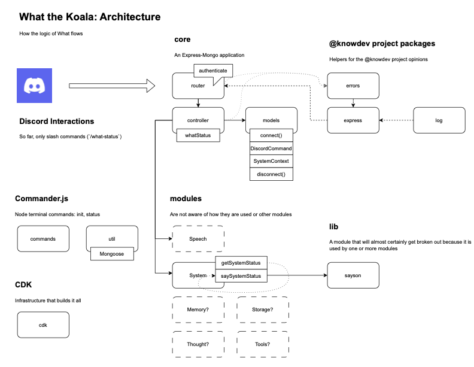

# Adam Finlayson or `nullfame` 🐓

AWS cloud and JavaScript developer. A petal from a steel magnolia

* ✊ Verbs: connect, empower, build
* 🤩 Expertise: Node, serverless AWS, observability, site reliability, automation
* 😎 Interests: Crypto, natural language processing, generative art, emergent behavior
* 🥰 Hobbies: Splinterlands, Minecraft, community building, electoral campaigns

## 🎯 Focus

### Prioritization 📋

I believe in prioritization that is honest about impact and capability. There is a parable I share on how to achieve your goals: write down twenty-five things you want to accomplish in life and then cross off twenty of them. Those are distractions. The backlog is not the good idea log and the roadmap should be clear.

### Testing 🧪

I practice and teach test-driven development with a heavy use of mocks to confirm intended actions. Once you start to look at code only through the lens of testing and observing mocks, hopefully you find it is faster both to start a feature from scratch but also to hunt down bugs. Logging plays an essential role here.

Ideally testing covers four areas in a full stack application:

* Unit tests at the feature level (Jest)
* Browser tests at the feature level (Cypress)
* Integration tests for APIs at the feature level (Postman)
* Automated browser and integration tests against production and preview environments

### Logging 📢

Logs should tell a story. Good programmers are more storytellers than engineers. Logs are a great way to demo a feature, especially in real time if you have an observability platform like Datadog. Logs should read like a story so someone unfamiliar with the code can see where things went wrong and hopefully what pieces of the state caused it.

The first thing I log is the request/event and the response. In the event I like to record the commit hash of the build. If this pattern is repeated in service calls (e.g., using OpenTelemetry) it is often possible to replicate the responses and therefore the bug in a non-production environment.

### Automation 👷

Having multiple, stand-alone environments makes every aspect of software development easier over the long term. Automating application and ideally infrastructure deployment is essential. Within the AWS ecosystem I prefer CDK which allows developers to work in their native language to deploy AWS components. I usually deploy CDK apps right from a GitHub Action but they can also be orchestrated with Terraform.

## 🥽 Current Project

### Summer 2023: What the Koala 🐨

Large language model Discord bot that uses OpenAI APIs to generate responses
in the form of an educational but annoying comedic sidekick koala named “What.”

The long-term goals are:
* Memory, session-based to start but ideally using some combination of vector, graph, and document storage for persistence
* To give her a knowledge base to respond to simple queries (again, backed by the memory)
* To give her a simple toolchain to accomplish simple tasks (e.g., check the weather)

The architecture is a Node Express app running in AWS Lambda behind an API Gateway. This approach provides all the conventions and conveniences of Express in a serverless environment without having to listen to the port and all the associated hassles of orchestration. The storage layer is MongoDB.  I’m using the OpenAI API to process text. I am inspired by langchain so I hew closely to their conventions, but as a library it is a moving target and the native language is Python. 

## 📄 Résumé

* 🇺🇸 Location: Evanston, IL, USA (2004-present)
* 💼 Current Occupation: Homemaker (May 2023-present)
* 🗄️ Previous Employers: Stax Payments (2022-2023), acquirer of CardX (2019-2021); Northwestern University (2001-2019)
* 🎓 Education: Bachelor of Arts in Mathematics, Cornell College 2001

## 🌐 Socials

* 👾 Discord is where I am most active
* 🤝 [LinkedIn](https://www.linkedin.com/in/adammarkfinlayson/)
* 🦤 [Twitter](https://twitter.com/nullfame)